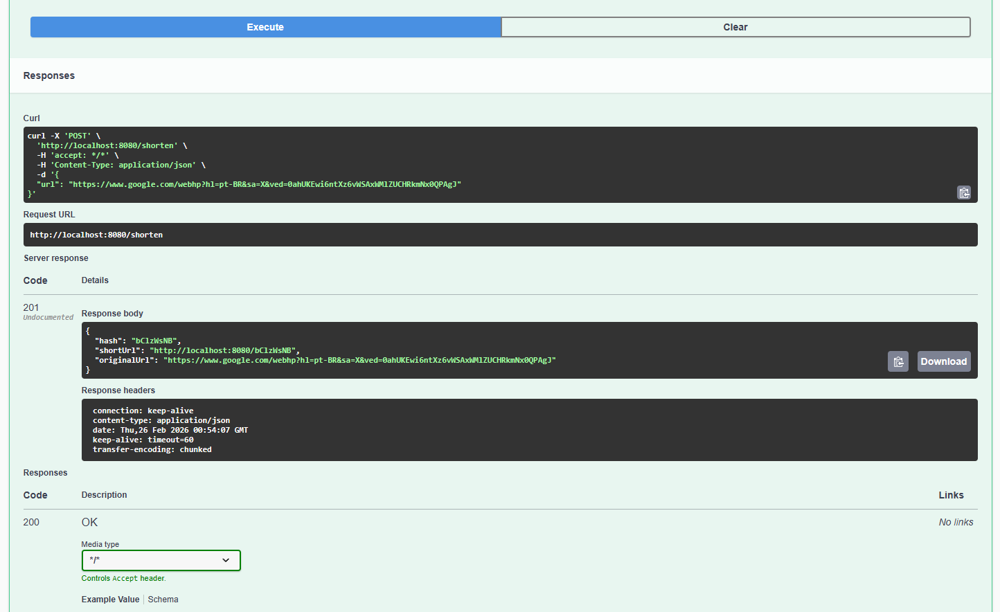

### Encurtador de URLs de Alta Performance

API de encurtamento de URLs construída com **Java 21**, **Spring Boot 3**, **PostgreSQL**, **Redis** e **Docker Compose**, seguindo o padrão **Cache Aside** para alta performance de leitura.

---

### Stack Técnica

- **Linguagem**: Java 21  
- **Framework**: Spring Boot 3  
- **Módulos Spring**:
  - Spring Web
  - Spring Data JPA
  - Spring Data Redis
  - Bean Validation
- **Banco de Dados**: PostgreSQL  
- **Cache**: Redis (via `StringRedisTemplate`)  
- **Documentação**: springdoc-openapi (Swagger UI em `/swagger-ui.html`)  
- **Build**: Maven  
- **Infra**: Docker Compose (PostgreSQL + Redis)  

---

### Como rodar o projeto

- **1. Pré-requisitos**
  - Docker e Docker Compose instalados
  - JDK 21+
  - Maven 3.9+

- **2. Subir infraestrutura (PostgreSQL + Redis)**

No diretório raiz do projeto:

```bash
docker-compose up -d
```

Isso vai subir:
- PostgreSQL em `localhost:5432` com:
  - DB: `urlshortener`
  - User: `urlshortener`
  - Password: `urlshortener`
- Redis em `localhost:6379`

- **3. Rodar a aplicação Spring Boot**

```bash
mvn spring-boot:run
```

A aplicação iniciará em `http://localhost:8080`.

- **4. Acessar documentação Swagger**

Acesse no navegador:

`http://localhost:8080/swagger-ui.html`

---

### Endpoints principais

- **POST `/shorten`**
  - **Descrição**: Recebe uma URL original e devolve um hash encurtado.
  - **Request (JSON)**:

```json
{
  "url": "https://www.google.com"
}
```

  - **Response 201 (JSON)**:

```json
{
  "hash": "aB3dE9xY",
  "shortUrl": "http://localhost:8080/aB3dE9xY",
  "originalUrl": "https://www.google.com"
}
```

- **GET `/{hash}`**
  - **Descrição**: Busca a URL original a partir do hash e redireciona com HTTP 302.
  - **Response 302**:
    - Header `Location: https://www.google.com`

---

### Exemplos de cURL

- **Criar URL encurtada**

```bash
curl -X POST "http://localhost:8080/shorten" \
  -H "Content-Type: application/json" \
  -d '{"url": "https://www.google.com"}'
```

- **Seguir redirecionamento de um hash**

Suponha que o hash retornado foi `aB3dE9xY`:

```bash
curl -i "http://localhost:8080/aB3dE9xY"
```

Você verá uma resposta com `HTTP/1.1 302 Found` e o header `Location` apontando para a URL original.

- **Exemplo de 404 amigável**

```bash
curl -i "http://localhost:8080/hashInexistente"
```

Resposta (exemplo):

```json
{
  "timestamp": "2026-02-25T12:34:56.789Z",
  "status": 404,
  "error": "URL não encontrada",
  "message": "URL encurtada não encontrada para o hash: hashInexistente",
  "path": "/hashInexistente"
}
```

Print do Swagger:



---

### Decisões de Arquitetura

- **Por que Redis?**
  - **Alta performance de leitura**: o caso de uso típico de encurtador de URLs é extremamente "read-heavy". Após o primeiro acesso, o hash é resolvido diretamente no Redis (memória) com latência muito menor do que consultas no banco relacional.
  - **Desacoplamento do banco relacional**: reduzimos a pressão no PostgreSQL para operações muito frequentes, mantendo o banco como fonte de verdade (source of truth) e o Redis como camada de cache.
  - **Padrão Cache Aside**:
    - **Leitura**:
      - A aplicação **primeiro** tenta buscar no cache Redis (log: **"Log: Buscando no Cache..."**).
      - Se for **cache miss**, busca no PostgreSQL (log: **"Log: Cache Miss - Buscando no Banco..."**) e então grava no Redis.
    - **Escrita**:
      - Ao criar uma nova URL encurtada, grava no PostgreSQL e já popula o Redis.

- **Geração de Hash (Base62-like)**
  - O serviço gera um hash curto com caracteres `[0-9a-zA-Z]`, de tamanho fixo (8), suficiente para espaço grande de combinações.
  - Em caso raro de colisão de hash, um novo hash é gerado (garantido via checagem no PostgreSQL).

- **Tratamento de Erros**
  - Quando o hash não existe, uma `UrlNotFoundException` é lançada e tratada por um `@RestControllerAdvice`, retornando **HTTP 404** com payload JSON amigável.
  - Erros de validação (por exemplo URL inválida) retornam **HTTP 400** com detalhes do campo.

- **Swagger / OpenAPI**
  - O projeto usa `springdoc-openapi-starter-webmvc-ui`.
  - A UI está configurada para abrir em `/swagger-ui.html`.

---

### Observações

- As mensagens de log importantes seguindo o requisito são:
  - **"Log: Buscando no Cache..."**
  - **"Log: Cache Miss - Buscando no Banco..."**
- Você pode customizar a propriedade `app.shortener.base-url` em `application.yml` ou em variáveis de ambiente para refletir o host público (ex: um domínio real ou porta diferente).

